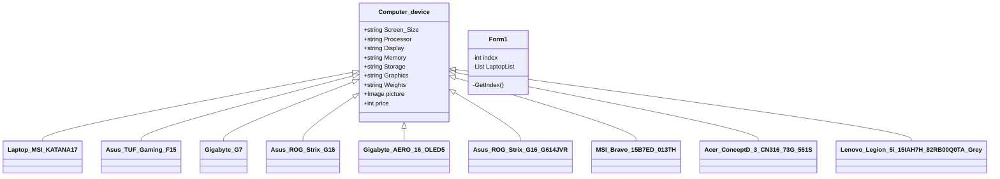

```mermaid
classDiagram
    Computer_device <|-- Laptop_MSI_KATANA17
    Computer_device <|-- Asus_TUF_Gaming_F15
    Computer_device <|-- Gigabyte_G7
    Computer_device <|-- Asus_ROG_Strix_G16
    Computer_device <|-- Gigabyte_AERO_16_OLED5
    Computer_device <|-- Asus_ROG_Strix_G16_G614JVR
    Computer_device <|-- MSI_Bravo_15B7ED_013TH
    Computer_device <|-- Acer_ConceptD_3_CN316_73G_551S
    Computer_device <|-- Lenovo_Legion_5i_15IAH7H_82RB00Q0TA_Grey
    class Form1{
        -int index
        -List<string> LaptopList
        -GetIndex()
    }
    class Computer_device{
        +string Screen_Size
        +string Processor
        +string Display
        +string Memory
        +string Storage
        +string Graphics
        +string Weights
        +Image picture
        +int price
    }
```
