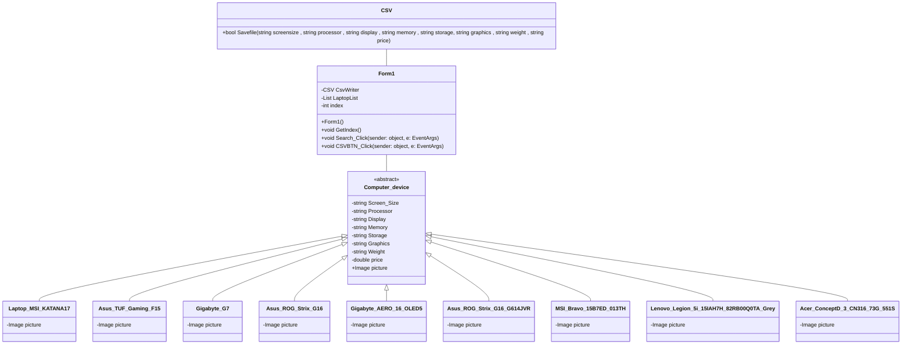

ความเป็นมาของโปรแกรม
ปัญหาเลือกโน้ตบุ๊กมาใช้งานไม่ได้
วัตถุประสงค์ของโปรแกรม
แนะนำโน้ตบุ๊กมาให้เลือกดูแบบคร่าวๆ
โครงสร้างของโปรแกรม (Class diagram) ของโปรแกรม ใช้ Mermaid ในการเขียน ตัวอย่าง การเขียน Classdiagram ใน Markdown

ชื่อของผู้พัฒนาโปรแกรม 
นายกีรติ สุวรรณภูสิทธิ์ 663450172-5
tomtimflow@gmail.com
